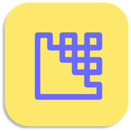

<p float="left">


</p>


# Python.ImageEncoder




Encode secret messages in .bmp images

Because I can't get my head around jpg compression and it often leads to
them behaving oddly, this program seems better suited to uncompressed images.
Admittedly this is far less useful in the wild but will still allow me to
practice some steganography. It will be best to use bmp images here

## Download
### Clone
#### Using The Command Line 
1. Press the Clone or download button in the top right
2. Copy the URL (link)
3. Open the command line and change directory to where you wish to clone to
4. Type 'git clone' followed by URL in step 2
```bash
$ git clone https://github.com/[user-name]/[repository]
```

More information can be found at 
<https://help.github.com/en/articles/cloning-a-repository> 

#### Using GitHub Desktop
1. Press the Clone or download button in the top right
2. Click open in desktop
3. Choose the path for where you want and click Clone

More information can be found at 
<https://help.github.com/en/desktop/contributing-to-projects/cloning-a-repository-from-github-to-github-desktop>

### Download Zip File

1. Download this GitHub repository
2. Extract the zip archive
3. Copy/ move to the desired location


## Language information 
### Built for
This program has been written for Python 3 and has been tested with 
Python version 3.7.0 <https://www.python.org/downloads/release/python-370/> 
on a Windows 10 PC. 
### Other versions
To install Python, go to <https://www.python.org/> and download the latest 
version. 
## How to run
1. Open the .py file in IDLE
2. Run by pressing F5 or by selecting Run> Run Module


## Define application constants
The default values for HEADER_SIZE, FOOTER_SIZE and MAX_SECRET_LEN are 1024. 
This can be changed with minimal impact on the program

- HEADER_SIZE
The minimum value that I would recommend setting this to would be 256. After 
a quick look on Wikipedia, it looks like anywhere between 16 and 196 bytes are 
required for the header. Setting it at 256 or higher seems safe.

- FOOTER_SIZE
It doesn't look like a bitmap has a footer. This was included for .jpg images. 
Play around with it if you would like but there is certainly no harm in 
leaving it at the default value 

- MAX_SECRET_LEN
This was included to stop python crashing. In a future version I will 
terminate the decoder when it encounters the first null character. This would 
likely remove the need for this. Or would certainly make it less essential. 
Using larger values will decrease the speed of the program but shouldn't have 
an adverse effect

I've done an MD5 hash of "CLEAN" and appended it to the filename to reduce
the chance of overwriting an important file

## Functions 
Read image file in 
```python
readImg(imageName):
```
Write image file out 
```python
writeImg(imageName):
```
Get the size of the image in bytes to prevent overwriting footer
```python
getSize(imageName):
```
Replace the least significant bit with a 0 
```python
writeCleanImg(inputImgName, outputImgName):
```
Write a secret message to the image 
```python
writeEncodedImg(inputImgName, outputImgName, secretMsg):
```
Calculate the LSB value to write  
```python
calculateLSB(byte, secretMsg):
```
Read the encoded image 
```python
readEncodedImg(inputImgName):
```
The CLI
```python
cli():
```

## Using the CLI 
"Clean, Encode, Clean and Encode (.bmp only), Decode or Quit? (C, e, a, d, q)"

- Entering 'c' will clean an image (specified by its path)
- Entering 'e' will encode an image (specified by its path)
- Entering 'a' will clean and encode an image (specified by its path)
- Entering 'd' will decode an image (specified by its path)
- Entering 'q' will quit the program 

"Type the name of the input image (include the file extension and path if 
required)"

- Enter the path to an input image 

"Type the name of the output image (include the file extension and path if 
required)"

- If the user selected Clean, Encode, or Clean and Encode. Enter the path of 
an output image 
   
"Type the secret message (max MAX_SECRET_LEN characters)"

- If the user selected Encode, or Clean and Encode. Enter a message for the 
program to encode in the image  


## Licence 
MIT License
Copyright (c) fredhappyface
(See the [LICENSE](/LICENSE.md) for more information.)


<!--
TODO: Add screenshots to readme-assets/screenshots/desktop/ named 
screenshot-[number].png
-->
## Screenshots 

### Desktop 
|Screenshots                                                                                  |
|:-:                                                                                          |
||
||
|| 


## Limited Support
Expect this project to be supported for approximately 6 months (for bug-fixes 
only). Note that this is not guaranteed. Create an issue for bugs (as this 
project is carried out in spare time, you may have to wait for a few days)


